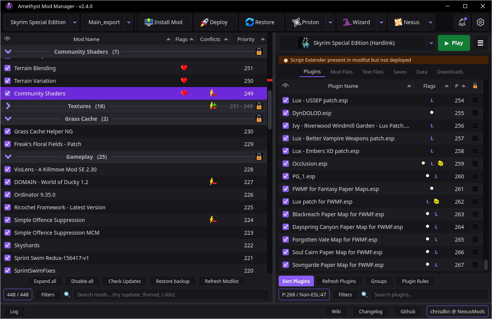

<p align="center">
    
</p>
<h1 align="center">Amethyst Mod Manager</h1>

<h3 align="center">A mod manager for Linux.</h3>
<h5 align="center">
  <a href="https://www.nexusmods.com/site/mods/1714">Nexus</a> |
  <a href="https://github.com/ChrisDKN/Amethyst-Mod-Manager/wiki">Wiki</a> |
  <a href="https://ko-fi.com/chrisdkn">Ko-Fi</a>
</h4>

<p align="center">
    
</p>

## Key Features

- **Mo2 style interface** - If it's not broke, don't fix it
- **Install Nexus Collections** - Handles fast mod installs, Collection load orders, applies fomod options and mod diff patches automatically.
- **Create Nexus Collections** - Ability to create, edit and upload Nexus collections
- **In app Nexus Browser** - View and install mods straight into the manager, from the manager
- **In app Thunderstore Browser** - View and install mods for Thunderstore supported games
- **Loot support** - Libloot is built into the application and optimised for fast plugin sorting
- **Update checking** - Quickly check all mods for Nexus updates. Bg3 mods installed via mod.io can also be checked for updates
- **Multi game support** - Bethesda, RE Engine (including pak invalidation), Bg3, CP2077 and a lot more. Designed to make adding game support easy
- **Multiple Deploy methods** - Deploy as symlinks, Hardlinks or as a VFS
- **Automated tool setup** - Run things like Pandora,pgpatcher,dyndolod with a few clicks
- **Root folder building** - Most mods that need to go to root do so automatically, no setup needed. Anything else can be toggled to go to root with a couple clicks
- **Smart game restore** - Amethyst uses hardlinks and symlinks but will restore the game to it's previous state while moving any runtime generated files back to staging
- **Multi platform detection** - Detects games installed by Steam, Heroic, Lutris and Faugus

---

## Install

**The Application may ask to set a password, This is for the OS keyring to store your nexus API key as we do not store it in a plain text file. Set the password to anything you want**

### Appimage
Run the following command in a terminal. It will appear in your applications menu under Games and Utilities.

```bash
curl -sSL https://raw.githubusercontent.com/ChrisDKN/Amethyst-Mod-Manager/main/src/appimage/Amethyst-MM-installer.sh | bash
```

Alternatively you download the appimage via the release page and install via gear lever

The application will notifiy when a new update goes live, Pressing the update button will rerun the script and update to any new version

### Flatpak

Run the following command

```bash
flatpak install --user https://chrisdkn.github.io/Amethyst-Mod-Manager/amethyst.flatpakref
```

The remote can also be added manually where you can then install from the app store/discover store

```bash
flatpak remote-add --user --if-not-exists modmanager-origin https://chrisdkn.github.io/Amethyst-Mod-Manager/amethyst.flatpakrepo
flatpak install --user modmanager-origin io.github.Amethyst.ModManager//stable
```

The repo carries two branches, `stable` and `beta`, so name the one you want.

Updates will be shown in your package manager

Manually swap to the beta branch

```bash
flatpak install --user --reinstall modmanager-origin io.github.Amethyst.ModManager//beta
```

(swap `--user` for `--system` if that's where you installed it)

Installing from a bundle skips the 32-bit compat extensions that running Windows tools (Proton/wine) requires - The app installs them automatically on first launch, or you can add them yourself:

```bash
flatpak install --user flathub org.freedesktop.Platform.Compat.i386//24.08 org.freedesktop.Platform.GL32.default//24.08
```

### AUR
<a href='https://aur.archlinux.org/packages/amethyst-mod-manager'>
	
</a>

---

## Games Supported

Almost 100 games are currently added/supported. See the [wiki](https://github.com/ChrisDKN/Amethyst-Mod-Manager/wiki#supported-games) for the full list
- All Bethesda titles
- Cyberpunk 2077
- Baldurs Gate 3
- Stardew Valley
- RE Engine Titles
- BepInEx Games
- A lot of Ue5 Titles

---

## Wiki

See the [wiki](https://github.com/ChrisDKN/Amethyst-Mod-Manager/wiki) page for a detailed guide on how to the use the mod manager and its functions. 

The wiki is also built into the manager and can be viewed there.

For building from source see the section on the wiki [here](https://github.com/ChrisDKN/Amethyst-Mod-Manager/wiki#building-from-source) 

## Supporting the project

Your feedback is enough and is greatly appreciated as this benefits everyone but if you'd like donate you can on Ko-fi 

<a href='https://ko-fi.com/R6R51XJ80I' target='_blank'></a>
